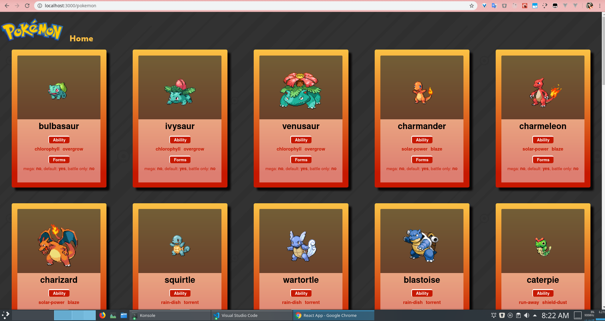

# Pokemon cards

## Execução

#### instalar as depedências
```console
yarn install
```

#### iniciar a aplicação
```console
yarn start
```

#### executar os testes
> coloquei um timeout de 20s, as várias requisições tomam um certo tempo
```console
yarn test
```

#### formatar o código
> estou utilizando o prettier, para manter o código determinístico em sua forma e facilitar merges e rebases.
``` console
yarn prettier
```

## Descrição
O projeto tem duas páginas, a `Home`  e `ListPokemon`, a rota _default_ vai para  a Home,  e o bontão **GO!** leva para a listagem de cards.

A página dos cards tem scroll infinito como mecanismo de paginação, o loader (que indica carregamento da página) é uma pokebola que passa no rodapé da página, feita 100% em CSS, e em cada card abrirá detalhes das `abilities` em um modal.

#### Stack
- React
- React Hooks
- styled-components
- Reach Router


